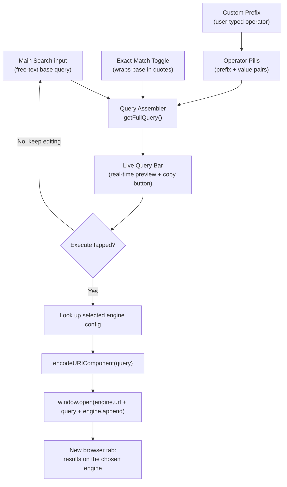
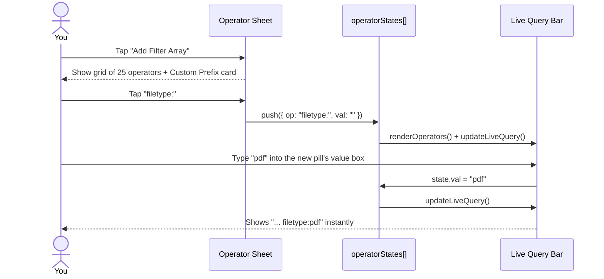
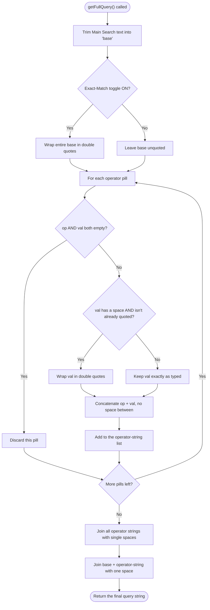
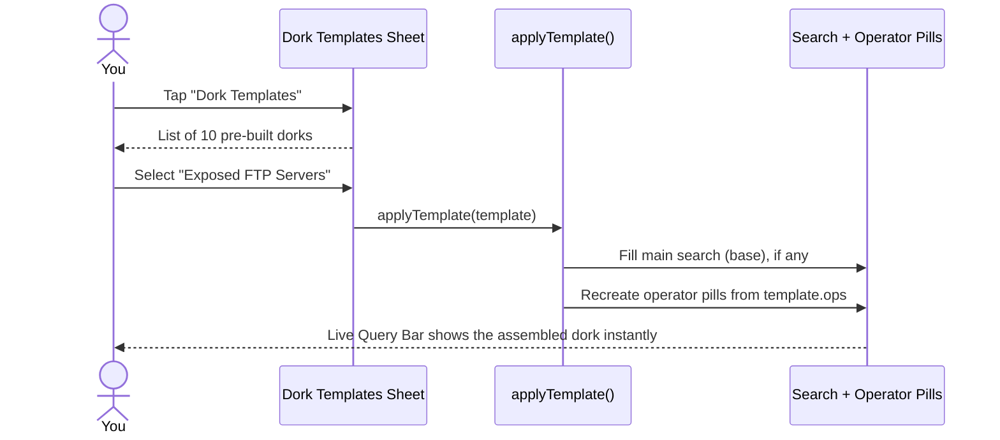
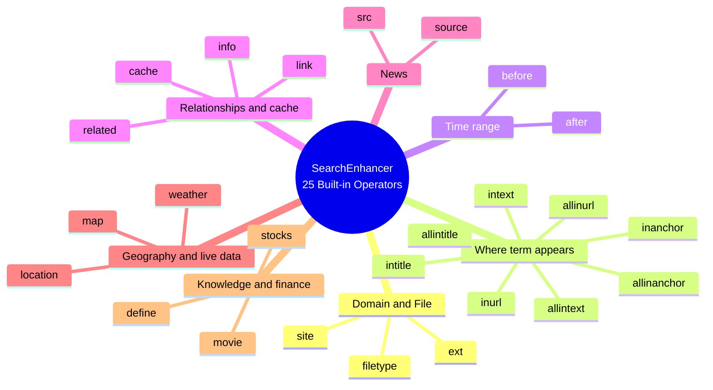
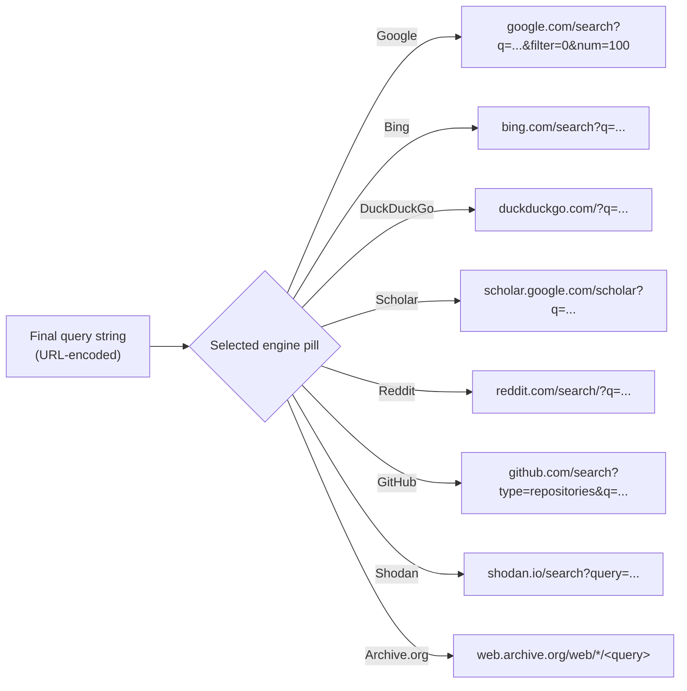

# SearchEnhancer — Precision Query Instrument

A single-file, zero-dependency, browser-based visual query builder for assembling advanced search-engine queries ("search dorks") across eight different engines and platforms — without memorizing syntax or risking a typo.

| | |
|---|---|
| **Type** | Single-file client-side web app (HTML + CSS + vanilla JS) |
| **Dependencies** | None (only Google Fonts CDN for typography) |
| **Backend** | None — everything runs in the browser |
| **Built-in operators** | 25 |
| **Destination engines** | 8 |
| **Ready-made dork templates** | 10 |
| **In-app learning guides** | 3 |
| **Escape hatch for anything else** | Custom Prefix input |

---

## Table of Contents

1. [Overview](#overview)
2. [Quick Start](#quick-start)
3. [How It Works](#how-it-works)
4. [Interface Tour](#interface-tour)
5. [Usage Examples](#usage-examples)
6. [Complete Operator Reference](#complete-operator-reference)
7. [Query Assembly Rules](#query-assembly-rules)
8. [Exact Match vs Auto Quoting](#exact-match-vs-auto-quoting)
9. [Custom Prefix](#custom-prefix)
10. [Built-in Dork Templates](#built-in-dork-templates)
11. [Multi-Engine Routing](#multi-engine-routing)
12. [Built-in Deep Search Guides](#built-in-deep-search-guides)
13. [Operator Gap Analysis](#operator-gap-analysis)
14. [Suggested Roadmap](#suggested-roadmap)
15. [Responsible Use and Legal Notice](#responsible-use-and-legal-notice)
16. [Project Info](#project-info)

---

## Overview

Advanced search operators (`site:`, `filetype:`, `intitle:`, and dozens of others) are one of the highest-leverage skills in research, OSINT, journalism, SEO auditing, and authorized security testing. The problem is that they are easy to forget, easy to mistype, and their exact syntax differs from engine to engine.

**SearchEnhancer** turns that syntax into a point-and-click experience. You type your topic into one box, attach operators as removable "pills," watch the exact resulting query string build itself in real time, and then fire it at the search engine of your choice in a new tab. Nothing is sent anywhere until you press Execute — the tool only *assembles a URL*; it never scans, crawls, or contacts any third-party system on its own.

It is intended for:

- OSINT researchers and journalists doing source discovery
- Security researchers / pentesters performing **authorized** reconnaissance
- SEO and content researchers auditing indexation
- Developers checking whether their own files have leaked into a search index
- Anyone who wants to get better at search literacy

---

## Quick Start

1. Open the HTML file in any modern browser — no install, no build step, no server required.
2. Type a topic into the main search bar.
3. Optionally tap **Add Filter Array** to attach one or more operators.
4. Watch the **Live Query Bar** at the top update as you type.
5. Pick a destination engine from the strip (Google is the default).
6. Tap the **Execute** (▶) button — your assembled query opens in a new tab on that engine.

---

## How It Works

SearchEnhancer keeps track of three pieces of state in memory: the **base text** typed into the main search field, a list of **operator pills** (`operatorStates[]`, each an operator/value pair), and the **exact-match flag**. Every keystroke re-runs the same assembly function and re-paints the Live Query Bar, so what you see is always exactly what will be sent.

### Architecture at a Glance



### Operator Lifecycle (Sequence)

This is what actually happens, end to end, when you attach a new operator and fill it in:



### The Assembly Algorithm

The actual logic behind `getFullQuery()` — the single function responsible for everything you see in the Live Query Bar:



**The one edge case worth knowing:** a pill is only dropped if *both* its operator and its value are empty. If you attach an operator (say `site:`) and never type a value, that bare `site:` will still be appended to your query. Always fill in a value, or remove the pill with the ✕ button.

---

## Interface Tour

| Element | What it does |
|---|---|
| **Live Query Bar** | Read-only preview of the exact string that will be sent, with a one-tap **copy** button. |
| **Operator Hint** | A dismissible helper strip that shows the description of whichever operator's value box currently has focus. |
| **Main Search Input** | The free-text "base" portion of your query. |
| **Exact-Match Toggle (`"`)** | Wraps the *entire* base query in double quotes for literal phrase matching. |
| **Execute Button (▶)** | Builds the final URL and opens it in a new tab on the selected engine. |
| **Engine Strip** | Eight pills — Google, Bing, DuckDuckGo, Scholar, Reddit, GitHub, Shodan, Archive.org — pick one before executing. |
| **Add Filter Array** | Opens a bottom sheet with all 25 built-in operators plus a Custom Prefix card. |
| **Dork Templates** | Opens a bottom sheet with 10 ready-made query combinations you can apply in one tap. |
| **Deep Search Guides** | Opens a bottom sheet with three short written guides (covered in [§12](#built-in-deep-search-guides)). |
| **Operator Pills** | Each attached operator renders as a removable card: a label (or editable box, for Custom Prefix) plus a value input. |

---

## Usage Examples

### Example 1 — Domain-Restricted File Search *(beginner)*

**Goal:** Find PDF files about "mars rover" published on NASA's domain.

1. Type `mars rover` into the main search bar.
2. **Add Filter Array** → choose `site:` → type `nasa.gov`.
3. **Add Filter Array** again → choose `filetype:` → type `pdf`.
4. Leave Exact-Match off (we want a normal keyword match, not a literal phrase).
5. Keep **Google** selected and tap Execute.

```
Assembled query:  mars rover site:nasa.gov filetype:pdf
Request sent to:  https://www.google.com/search?q=mars%20rover%20site%3Anasa.gov%20filetype%3Apdf&filter=0&num=100
```

The base `mars rover` stays unquoted, the two pills resolve to `site:nasa.gov` and `filetype:pdf`, and everything joins with single spaces.

---

### Example 2 — Multi-Word Values Get Auto-Quoted

**Goal:** Find open directory listings whose page title is literally "index of /backup".

1. Leave the main search bar empty.
2. **Add Filter Array** → `intitle:` → type `index of /backup`.
3. Execute on Google.

```
Assembled query:  intitle:"index of /backup"
```

Because the value contains spaces and doesn't already start with a quote, the assembler wraps it automatically. **You never have to type quotation marks inside an operator's value box** — SearchEnhancer adds them whenever a value contains a space.

---

### Example 3 — Stacking Multiple Operators

**Goal:** Locate exposed SQL dump files that reference user passwords.

1. Type `insert into users` into the main search bar.
2. **Add Filter Array** → `ext:` → `sql`.
3. **Add Filter Array** → `intext:` → `password`.
4. Execute on Google.

```
Assembled query:  insert into users ext:sql intext:password
```

This is exactly what the built-in **"Exposed SQL Dumps"** template produces in one tap — see [§10](#built-in-dork-templates).

---

### Example 4 — Date-Boxing a Topic

**Goal:** See how a topic was discussed in just the first half of 2024.

1. Type `chip shortage` into the main search bar.
2. **Add Filter Array** → `after:` → `2024-01-01`.
3. **Add Filter Array** → `before:` → `2024-07-01`.
4. Execute on Google.

```
Assembled query:  chip shortage after:2024-01-01 before:2024-07-01
```

---

### Example 5 — Extending the Tool with Custom Prefix

**Goal:** Use Bing's `feed:` operator (RSS/Atom feed discovery) — it isn't one of the 25 built-ins.

1. Switch the engine strip to **Bing**.
2. **Add Filter Array** → choose the **Custom Prefix** card.
3. Type `feed:` into the new editable prefix box, then `security` into its value box.
4. Execute.

```
Assembled query:  feed:security
```

Custom Prefix turns the 25 built-ins into a starting point rather than a ceiling — any colon-style operator, on any engine, can be bolted on manually. [Section 13](#operator-gap-analysis) lists the ones most worth adding this way.

---

### Example 6 — One-Tap Recon with a Dork Template

**Goal:** Look for exposed FTP directory listings without typing anything.



```
Assembled query:  intitle:"index of" inurl:ftp
```

---

## Complete Operator Reference

All 25 operators currently built into the tool, grouped by purpose.



**Domain & File Type**

| Operator | Example | What it does |
|---|---|---|
| `site:` | `site:nasa.gov` | Restricts results to one domain or TLD. |
| `filetype:` | `filetype:pdf` | Finds files of a specific type. |
| `ext:` | `ext:env` | Strict extension match on the URL string itself — catches raw developer files that lack proper MIME headers. |

**Where the Term Appears**

| Operator | Example | What it does |
|---|---|---|
| `intitle:` | `intitle:login` | Word/phrase must appear in the page's HTML title. |
| `allintitle:` | `allintitle:admin login` | *All* listed words must appear in the title. |
| `inurl:` | `inurl:wp-admin` | String must appear inside the URL. |
| `allinurl:` | `allinurl:admin panel` | *All* listed strings must appear in the URL. |
| `intext:` | `intext:"parent directory"` | Word/phrase must appear in the body text. |
| `allintext:` | `allintext:db_password` | *All* listed words must appear in the body text. |
| `inanchor:` | `inanchor:download` | Word must appear in the anchor text of inbound links. |
| `allinanchor:` | `allinanchor:click here` | *All* listed words must appear in anchor text. |

**Time Range**

| Operator | Example | What it does |
|---|---|---|
| `before:` | `before:2024-01-01` | Only results indexed before this date. |
| `after:` | `after:2023-01-01` | Only results indexed after this date. |

**Relationships & Caching**

| Operator | Example | What it does |
|---|---|---|
| `related:` | `related:github.com` | Sites the engine considers similar. |
| `cache:` | `cache:example.com` | Engine's cached snapshot of a page. **See caveat below.** |
| `link:` | `link:example.com` | Pages that link to a specific URL. **See caveat below.** |
| `info:` | `info:example.com` | Summary info card about a URL. |

**News**

| Operator | Example | What it does |
|---|---|---|
| `source:` | `source:reuters` | Restricts news results to one outlet. |
| `src:` | `src:bloomberg` | Alias of `source:`. |

**Geography & Live Data**

| Operator | Example | What it does |
|---|---|---|
| `location:` | `location:seattle` | Geographically scopes results to a region. |
| `weather:` | `weather:tokyo` | Pulls a weather snippet for a place. |
| `map:` | `map:paris` | Forces a map result for a place. |

**Knowledge & Finance**

| Operator | Example | What it does |
|---|---|---|
| `define:` | `define:ephemeral` | Dictionary-style definition card. |
| `movie:` | `movie:inception` | Movie info card. |
| `stocks:` | `stocks:aapl` | Stock ticker snapshot. |

> **Live-engine caveat:** Google formally discontinued the `cache:` operator in 2024 — it no longer returns a cached page on Google itself, even though the syntax is still valid to type. The tool's own **Archive.org** engine pill is the modern replacement for "what did this page used to look like." Similarly, `link:` has returned only a small, non-comprehensive sample of backlinks for years rather than a full list. Both operators are kept in the tool for completeness, legacy reference, and because they may still behave differently on other engines — just don't expect a fresh Google cache from them today.

---

## Query Assembly Rules

In plain language, the rules `getFullQuery()` follows every time the Live Query Bar repaints:

1. The main search box is trimmed of leading/trailing whitespace — that becomes the **base**.
2. If **Exact Match** is on, the *entire* base is wrapped in one pair of double quotes.
3. Each operator pill becomes `operator + value` with **no space** between them (e.g. `site:` + `nasa.gov` → `site:nasa.gov`).
4. If a pill's value contains a space and doesn't already start with a quote, it is automatically wrapped in double quotes first.
5. A pill is skipped entirely only if *both* its operator and value are empty.
6. All operator strings are joined with single spaces, then joined to the base with one more single space.

---

## Exact Match vs Auto Quoting

These two quoting mechanisms are easy to conflate but solve different problems:

| Mechanism | Scope | Triggered by | Example |
|---|---|---|---|
| **Exact-Match Toggle** | The whole base query | Tapping the `"` button | `climate policy` → `"climate policy"` |
| **Auto Quoting** | One operator's value, individually | Typing a space inside any operator value | `intext:` value `parent directory` → `intext:"parent directory"` |

There is currently no way to quote just *part* of the base query (a sub-phrase) — quoting is all-or-nothing for the base, but automatic and per-value for operators. See [§13](#operator-gap-analysis) for a note on adding partial-phrase support.

---

## Custom Prefix

The **Custom Prefix** card sits at the top of the operator picker grid. Selecting it adds a pill with an *editable* label instead of a fixed one — type any colon-style prefix you like (`port:`, `language:`, `stars:`, `subreddit:`, anything) and it slots into the query exactly like a built-in operator.

This is the tool's escape hatch: it's how you reach every operator listed in [§13](#operator-gap-analysis) today, without waiting for it to be added as a dedicated card.

---

## Built-in Dork Templates

One tap applies a full base query plus a set of pre-filled operator pills.

| # | Title | Assembled Query | Typical Use |
|---|---|---|---|
| 1 | Open Directories (General) | `intitle:"index of" intext:"parent directory"` | Finds exposed file-listing directories on web servers. |
| 2 | Open Directories (Media) | `intitle:"index of" inurl:mp3\|flac\|wav` | Same, narrowed to audio-file directories. |
| 3 | Exposed Database Configs | `password OR db_password ext:env intext:DB_PASSWORD` | Surfaces leaked `.env` files containing DB credentials. |
| 4 | Confidential Gov Documents | `"confidential" OR "not for public release" site:gov ext:pdf` | Finds marked-sensitive PDFs on `.gov` domains. |
| 5 | Vulnerable Log Files | `error OR exception ext:log intext:stacktrace` | Finds exposed application/server logs with stack traces. |
| 6 | Exposed SQL Dumps | `insert into users ext:sql intext:password` | Finds leaked database dump files. |
| 7 | Find Subdomains | `site:*.*.com inurl:-www` | Helps enumerate subdomains of `.com` targets. |
| 8 | Archived Snapshots | `cache:example.com` | Intended to pull a cached page — see the `cache:` caveat in §6; the Archive.org engine is the working alternative. |
| 9 | Public Trello Boards | `jira OR password OR api_key site:trello.com inurl:b` | Finds publicly shared Trello boards that may leak secrets. |
| 10 | Exposed FTP Servers | `intitle:"index of" inurl:ftp` | Finds open FTP directory listings indexed by the search engine. |

> Several of these templates (3, 4, 5, 6, 9, 10) are recon-style "Google dorks" designed to surface accidentally-exposed data. They reflect long-public, widely taught search syntax (the same category of technique catalogued in resources like the Google Hacking Database), but they should only ever be pointed at systems and domains you own or are explicitly authorized to assess — see [§15](#responsible-use-and-legal-notice).

---

## Multi-Engine Routing



| Engine | Base URL | Compatibility notes |
|---|---|---|
| **Google** | `google.com/search?q=` | Only engine with special append params: `&filter=0&num=100` (disables near-duplicate filtering, requests up to 100 results). Most of the 25 built-ins were designed around Google's syntax. |
| **Bing** | `bing.com/search?q=` | Shares most Google-style operators (`site:`, `filetype:`, `intitle:`, `inurl:`) but has its own extras not yet in the tool — see §13. |
| **DuckDuckGo** | `duckduckgo.com/?q=` | Supports many Google-style operators too, plus its own `!bang` shortcuts, not represented here. |
| **Scholar** | `scholar.google.com/scholar?q=` | `site:` and `filetype:` still work; date filters behave differently than web Google. |
| **Reddit** | `reddit.com/search/?q=` | Native Reddit search largely ignores Google-style colon operators — effective filtering really needs `subreddit:`, `author:`, `flair:`, none of which exist in the tool yet. |
| **GitHub** | `github.com/search?type=repositories&q=` | Routed to GitHub's *repository* search, which uses its own qualifier syntax (`language:`, `stars:`, etc.) — most of the 25 generic operators won't filter anything here. |
| **Shodan** | `shodan.io/search?query=` | A device/IoT search engine, not a web crawler — none of the 25 web operators apply. Needs Shodan-specific filters that currently exist only as guide text (see §12), not selectable chips. |
| **Archive.org (Wayback)** | `web.archive.org/web/*/` | Works best with a bare domain in the main search box rather than keyword operators. |

---

## Built-in Deep Search Guides

Summaries of the three reference panels bundled into the **Deep Search Guides** sheet:

**1. The Power of `filetype:` and `ext:`** — `filetype:` matches by the engine's recognized file type, while `ext:` forces a literal match on the extension string in the URL, which is more reliable for catching raw developer artifacts that don't send proper MIME headers. Extensions worth hunting: `.env`, `.sql`, `.bak` / `.old`, `.log`, `.json`.

**2. Archive.org (Wayback Machine) Tips** — Selecting the Archive engine bypasses Google entirely. Appending an asterisk after a domain (`example.com/*`) reveals its whole crawled directory tree; it can recover deleted social posts when the original URL is known, and surface old versions of API docs or Terms of Service.

**3. Shodan Reconnaissance** — Shodan crawls internet-connected devices and servers, not web pages, so ordinary Google-style operators don't apply. The guide gives four Shodan-only filters as examples: `port:21`, `product:"Apache Tomcat"`, `os:"windows 7"`, `org:"Company Name"`. None of these exist as selectable operator cards today — see §13.

---

## Operator Gap Analysis

This is the honest answer to *"what operators exist that this tool doesn't have yet?"* — grouped by where they'd be useful, so you can decide what's worth adding.

### A. Universal query modifiers (usable on almost any engine, but no dedicated UI control exists — must be hand-typed into the main search box today)

| Syntax | Name | What it does |
|---|---|---|
| `-term` | Exclusion | Removes pages containing that term. |
| `OR` / `\|` | Boolean OR | Matches either term. |
| `*` | Wildcard | Acts as a placeholder for any word, especially inside quoted phrases. |
| `a..b` | Numeric range | Matches numbers (prices, years) within a range, e.g. `camera $50..$100`. |
| Partial-phrase quotes | Sub-phrase exact match | Quoting just part of the base query — today the Exact-Match toggle only quotes the *entire* base. |
| `AROUND(n)` | Proximity | Two terms within *n* words of each other; Google's support has weakened over time but it still partially works. |

### B. Built-in operators that engines themselves have weakened or retired

| Operator | Status |
|---|---|
| `cache:` | Fully discontinued by Google as of September 2024 — no longer returns results on Google search itself. |
| `link:` | Has returned only a small, non-comprehensive sample of backlinks for years rather than a complete list. |

### C. Bing-specific operators not represented (Bing is a selectable engine, but none of these exist as cards)

| Operator | What it does |
|---|---|
| `loc:` / `location:` | Filters results by country/region. |
| `language:` | Filters results by language code. |
| `ip:` | Finds pages hosted on a specific IP address. |
| `feed:` | Finds RSS/Atom web feeds matching a term. |
| `hasfeed:` | Finds pages that link to an RSS feed. |
| `contains:` | Finds pages that link to files of a given type (different from `filetype:`, which finds the file itself). |
| `prefer:` | Boosts the importance of a specific term in ranking. |
| `near:` | Proximity operator, similar in spirit to Google's `AROUND(n)`. |

### D. DuckDuckGo-specific syntax not represented

- `!bang` shortcuts (e.g. `!w` jumps straight to Wikipedia, `!yt` to YouTube) — DuckDuckGo's signature feature, entirely absent from the tool.
- Region/time-range filters, which DuckDuckGo exposes as URL parameters rather than inline operators.

### E. GitHub-specific qualifiers not represented (GitHub is a selectable engine, but routed traffic gets none of GitHub's real filtering)

| Qualifier | What it does |
|---|---|
| `language:` | Restricts to repos in a programming language. |
| `stars:` | Filters by star count (supports ranges). |
| `user:` / `org:` | Restricts to a specific account or organization. |
| `repo:` | Searches within one named repository. |
| `path:` | Restricts to files at a given path. |
| `extension:` | Restricts to files with a given extension. |
| `size:` | Filters by file size. |
| `pushed:` / `forks:` | Filters by last-push date or fork count. |

### F. Reddit-specific qualifiers not represented (Reddit is a selectable engine, but routed traffic gets none of Reddit's real filtering)

| Qualifier | What it does |
|---|---|
| `subreddit:` | Restricts to one community. |
| `author:` | Restricts to one poster. |
| `flair:` | Restricts to a specific post flair. |
| `self:` | Restricts to text-only posts. |
| `nsfw:` | Includes/excludes NSFW-tagged posts. |

### G. Shodan-specific filters (documented inside the tool's own Guides panel, but not implemented as selectable cards)

| Filter | What it does |
|---|---|
| `port:` | Devices listening on a given port. |
| `product:` | A specific software/hardware product banner. |
| `os:` | A specific operating system fingerprint. |
| `org:` | A specific owning organization. |
| `net:` | A specific IP range / CIDR block. |
| `city:` / `country:` | Geographic filters. |
| `hostname:` | A specific hostname. |
| `vuln:` | A specific CVE identifier. |

---

## Suggested Roadmap

A rough priority order for closing the gaps above, in case this becomes the next iteration:

1. **Add inline base-query controls** for exclusion (`-`), OR, and wildcard (`*`) — these are universal, high-value, and the biggest functionality gap today.
2. **Make the operator grid context-aware**: when Shodan, GitHub, or Reddit is the selected engine, swap in that platform's own qualifier set (sections C/E/F/G above) instead of the generic 25.
3. **Relabel `cache:`** as a legacy/historical operator in its tooltip, and consider having it auto-suggest switching to the Archive.org engine instead.
4. **Add a "favorite/save query" feature** so frequently-used custom prefixes or assembled queries don't need to be retyped each session.
5. **Surface a query history** of the last several executed searches for quick re-use.

---

## Responsible Use and Legal Notice

SearchEnhancer only assembles a text string and opens a standard search-results URL in your own browser tab — it does not scan, crawl, exploit, brute-force, or modify any third-party system, and it has no network logic beyond `window.open()`.

The advanced operators and dork templates included reflect long-public, widely taught search-engine syntax of the kind catalogued in open OSINT and security-research resources (such as the Google Hacking Database). That said, several of the built-in templates are explicitly designed to surface *accidentally exposed* data (credentials, database dumps, internal logs). Please:

- Only point recon-style templates at systems, domains, or data you **own** or are **explicitly authorized** to test.
- Respect each target's Terms of Service and `robots.txt`.
- Never use exposed credentials or data you discover to access a system — report it responsibly to the owner instead.
- Follow all applicable local laws regarding computer access and data privacy.

---

## Project Info

| | |
|---|---|
| **Maintainer** | Sangita |
| **Status** | Active, iterative development |
| **Architecture** | Single static HTML file — all CSS, JS, and data tables are inlined; no localStorage, cookies, or analytics |
